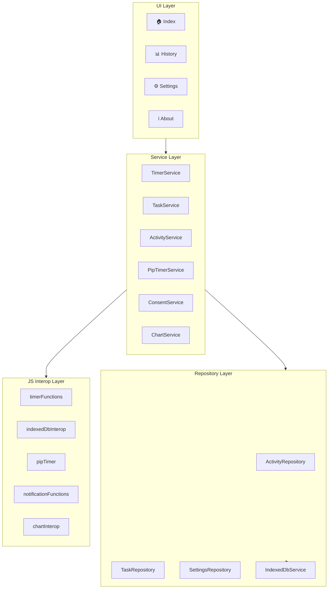
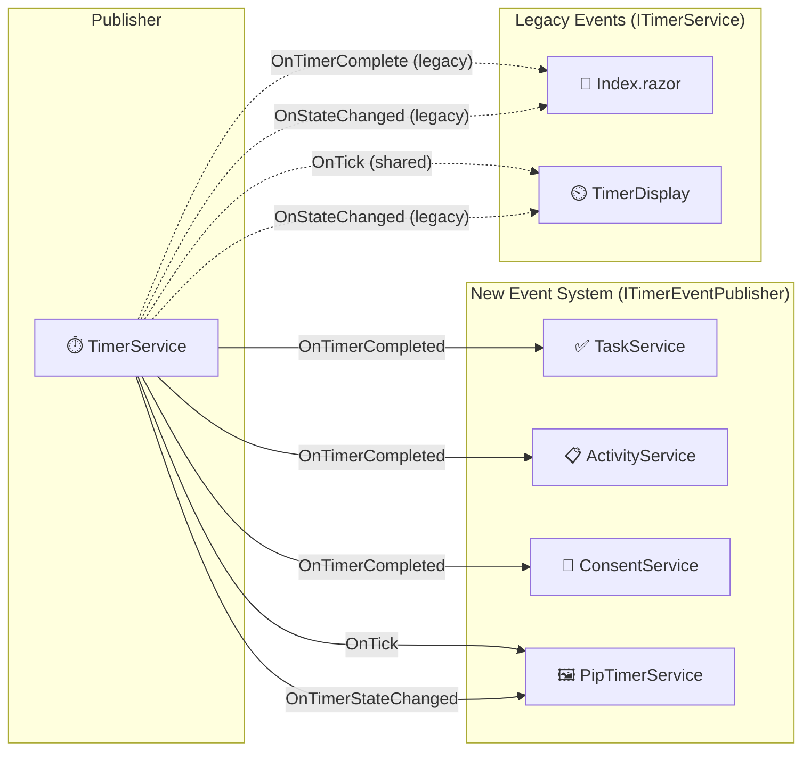
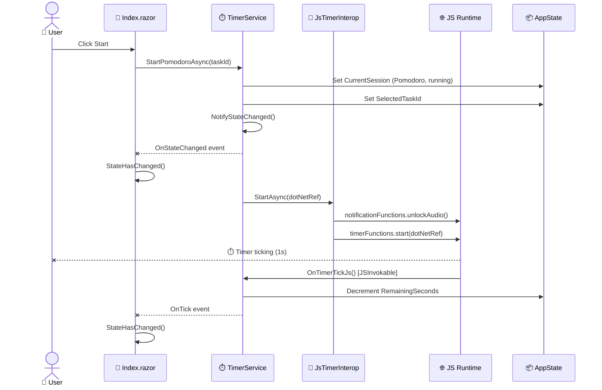
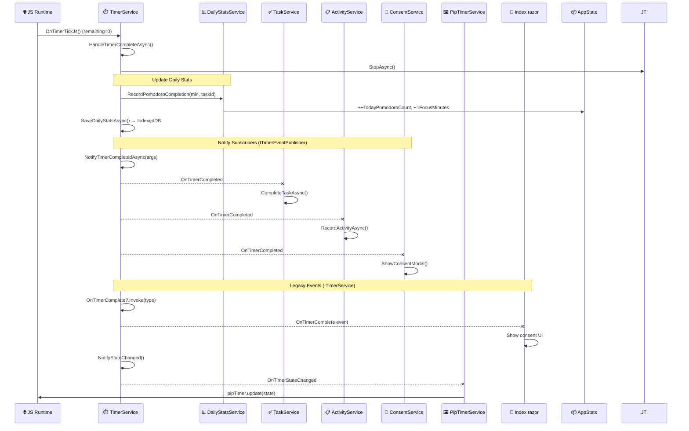
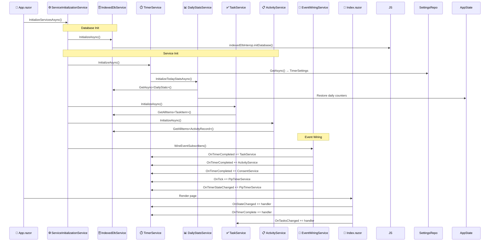
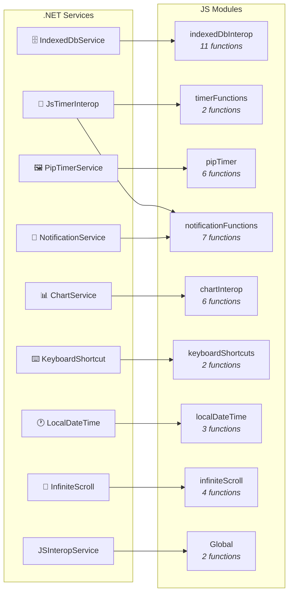
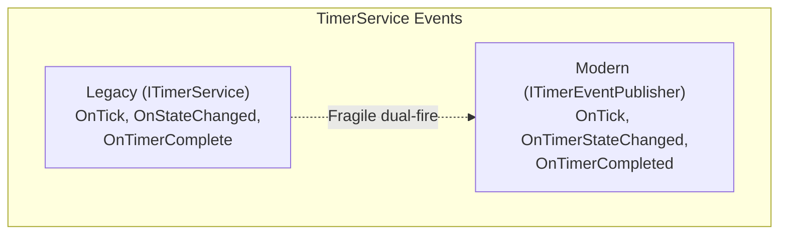
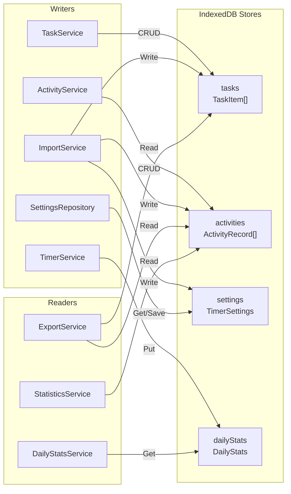

# Code Execution Map

## Architecture Overview

---

## Service Dependency Graph

```mermaid
graph TD
    subgraph Pages["Pages"]
        Index["📄 Index.razor<br/><i>12 injected services</i>"]
        History["📄 History.razor<br/><i>8 injected services</i>"]
        Settings["📄 Settings.razor<br/><i>8 injected services</i>"]
    end

    subgraph CoreServices["Core Services"]
        TimerService["⏱️ TimerService<br/><i>ITimerService, ITimerEventPublisher</i>"]
        TaskService["✅ TaskService<br/><i>ITaskService, ITimerEventSubscriber</i>"]
        ActivityService["📋 ActivityService<br/><i>IActivityService, ITimerEventSubscriber</i>"]
        PipTimerService["🖼️ PipTimerService<br/><i>IPipTimerService, ITimerEventPublisherSubscriber</i>"]
        ConsentService["🔔 ConsentService<br/><i>IConsentService, ITimerEventSubscriber</i>"]
    end

    subgraph ExtractedServices["Extracted Services"]
        DailyStatsService["📊 DailyStatsService"]
        JsTimerInterop["🔄 JsTimerInterop"]
        StatisticsService["📈 StatisticsService"]
        ImportService["📥 ImportService"]
        ExportService["📤 ExportService"]
        TodayStatsService["📅 TodayStatsService"]
    end

    subgraph UIInterop["UI Interop Services"]
        NotificationService["🔔 NotificationService"]
        ChartService["📊 ChartService"]
        KeyboardShortcutService["⌨️ KeyboardShortcutService"]
        LocalDateTimeService["🕐 LocalDateTimeService"]
        InfiniteScrollInterop["📜 InfiniteScrollInterop"]
    end

    subgraph Repositories["Repositories"]
        IndexedDbService["🗄️ IndexedDbService"]
        ActivityRepository["ActivityRepository"]
        TaskRepository["TaskRepository"]
        SettingsRepository["SettingsRepository"]
    end

    subgraph State["State"]
        AppState["📦 AppState<br/><i>Singleton</i>"]
    end

    subgraph Infra["Infrastructure"]
        JSRuntime["🌐 IJSRuntime"]
        SessionOptionsService["SessionOptionsService"]
        HistoryStatsService["HistoryStatsService"]
    end

    Index --> TimerService
    Index --> TaskService
    Index --> ConsentService
    Index --> NotificationService
    Index --> ActivityService
    Index --> PipTimerService
    Index --> AppState
    Index --> JSRuntime
    Index --> KeyboardShortcutService
    Index --> TodayStatsService
    Index --> InfiniteScrollInterop
    Index --> LocalDateTimeService

    History --> ActivityService
    History --> StatisticsService
    History --> JSRuntime
    History --> InfiniteScrollInterop
    History --> HistoryStatsService
    History --> LocalDateTimeService

    Settings --> TimerService
    Settings --> ExportService
    Settings --> ImportService
    Settings --> TaskService
    Settings --> ActivityService

    TimerService --> IndexedDbService
    TimerService --> SettingsRepository
    TimerService --> DailyStatsService
    TimerService --> JsTimerInterop
    TimerService --> AppState

    DailyStatsService --> IndexedDbService
    DailyStatsService --> AppState

    JsTimerInterop --> JSRuntime

    TaskService --> TaskRepository
    TaskService --> IndexedDbService
    TaskService --> AppState

    ActivityService --> ActivityRepository

    StatisticsService --> ActivityRepository

    ImportService --> ActivityRepository
    ImportService --> TaskRepository
    ImportService --> SettingsRepository

    ExportService --> ActivityRepository
    ExportService --> TaskRepository
    ExportService --> SettingsRepository

    PipTimerService --> JSRuntime
    PipTimerService --> TimerService
    PipTimerService --> TaskService
    PipTimerService --> AppState

    ConsentService --> TimerService
    ConsentService --> TaskService
    ConsentService --> NotificationService
    ConsentService --> AppState
    ConsentService --> SessionOptionsService

    NotificationService --> JSRuntime
    NotificationService --> AppState

    ChartService --> JSRuntime

    KeyboardShortcutService --> JSRuntime

    LocalDateTimeService --> JSRuntime

    SessionOptionsService --> AppState

    TodayStatsService --> ActivityService

    ActivityRepository --> IndexedDbService
    TaskRepository --> IndexedDbService
    SettingsRepository --> IndexedDbService

    IndexedDbService --> JSRuntime
```

---

## Event Flow Diagram

---

## Sequence: Timer Start

---

## Sequence: Timer Complete

---

## Sequence: App Initialization

---

## JS Interop Map

### .NET → JS Calls

| Module | Functions | Called By |
|--------|-----------|-----------|
| `indexedDbInterop` | `initDatabase`, `getItem`, `getAllItems`, `getItemsByIndex`, `getItemsByDateRange`, `putItem`, `putAllItems`, `deleteItem`, `clearStore`, `getCount`, `initializeJsConstants` | IndexedDbService |
| `timerFunctions` | `start`, `stop` | JsTimerInterop |
| `pipTimer` | `isSupported`, `registerDotNetRef`, `unregisterDotNetRef`, `open`, `close`, `update` | PipTimerService |
| `notificationFunctions` | `registerDotNetRef`, `unregisterDotNetRef`, `requestNotificationPermission`, `showNotification`, `playTimerCompleteSound`, `playBreakCompleteSound`, `unlockAudio` | NotificationService, JsTimerInterop |
| `chartInterop` | `createBarChart`, `createGroupedBarChart`, `createDoughnutChart`, `updateChart`, `destroyChart`, `ensureInitialized` | ChartService |
| `keyboardShortcuts` | `initialize`, `dispose` | KeyboardShortcutService |
| `localDateTime` | `getLocalDate`, `getLocalDateTime`, `getTimezoneOffset` | LocalDateTimeService |
| `infiniteScroll` | `isSupported`, `createObserver`, `destroyObserver`, `destroyAllObservers` | InfiniteScrollInterop |
| Global | `getUrlParameter`, `removeUrlParameter` | JSInteropService |

### JS → .NET Callbacks

| Method | Class | Trigger |
|--------|-------|---------|
| `OnTimerTickJs` | TimerService | Timer tick (1s interval) |
| `OnPipToggleTimer` | PipTimerService | PiP play/pause button |
| `OnPipResetTimer` | PipTimerService | PiP reset button |
| `OnPipSwitchSession` | PipTimerService | PiP session tab |
| `OnPipClosed` | PipTimerService | PiP window close |
| `OnNotificationActionClick` | NotificationService | Browser notification click |
| `OnSentinelIntersecting` | HistoryBase | Scroll sentinel visible |
| `HandleShortcut` | KeyboardShortcutService | Key press |
| `NavigateTo` | MainLayout | Navigation event |

---

## Dual Event System

TimerService fires both old and new events for backward compatibility:

| Notification | Legacy Event | Modern Event |
|---|---|---|
| Tick | `OnTick` (Action) | `OnTick` (Action) — same backing field |
| State changed | `OnStateChanged` (Action) | `OnTimerStateChanged` (Action) |
| Timer completed | `OnTimerComplete` (Action\<SessionType\>) | `OnTimerCompleted` (Func\<TimerCompletedEventArgs, Task\>) |

| Subscriber | System | Events |
|---|---|---|
| Index.razor | Legacy | `OnTimerComplete`, `OnStateChanged` |
| TimerDisplay.razor | Legacy | `OnTick`, `OnStateChanged` |
| TaskService | Modern | `OnTimerCompleted` |
| ActivityService | Modern | `OnTimerCompleted` |
| ConsentService | Modern | `OnTimerCompleted` |
| PipTimerService | Modern | `OnTick`, `OnTimerStateChanged` |

---

## Data Flow: IndexedDB

---

## Page Injection Summary

### Index.razor (12 services)

| Service | Purpose |
|---------|---------|
| `ITaskService` | Task CRUD, selection, completion |
| `ITimerService` | Timer start/pause/reset |
| `IConsentService` | Post-pomodoro consent modal |
| `INotificationService` | Browser notifications |
| `IActivityService` | Activity history queries |
| `IPipTimerService` | Picture-in-Picture timer |
| `AppState` | Global state (session, settings, stats) |
| `IJSRuntime` | Direct JS interop |
| `IKeyboardShortcutService` | Keyboard shortcuts |
| `ITodayStatsService` | Today's summary stats |
| `IInfiniteScrollInterop` | Infinite scroll for tasks |
| `ILocalDateTimeService` | Local date/time |
| `ILogger<IndexBase>` | Logging |

### History.razor (8 services)

| Service | Purpose |
|---------|---------|
| `IActivityService` | Activity queries |
| `IStatisticsService` | Weekly stats, time distribution |
| `IJSRuntime` | Direct JS interop |
| `IInfiniteScrollInterop` | Infinite scroll for activities |
| `IHistoryStatsService` | Daily summary formatting |
| `HistoryPagePresenterService` | View formatting logic |
| `ILocalDateTimeService` | Local date/time |
| `ILogger<HistoryBase>` | Logging |

### Settings.razor (8 services)

| Service | Purpose |
|---------|---------|
| `ITimerService` | Timer settings reference |
| `IExportService` | Data export (JSON) |
| `IImportService` | Data import (JSON) |
| `ITaskService` | Task data for import/export |
| `IActivityService` | Activity data for import/export |
| `IJSInteropService` | JS interop (file picker) |
| `SettingsPresenterService` | Settings formatting logic |
| `ILogger<SettingsPageBase>` | Logging |
