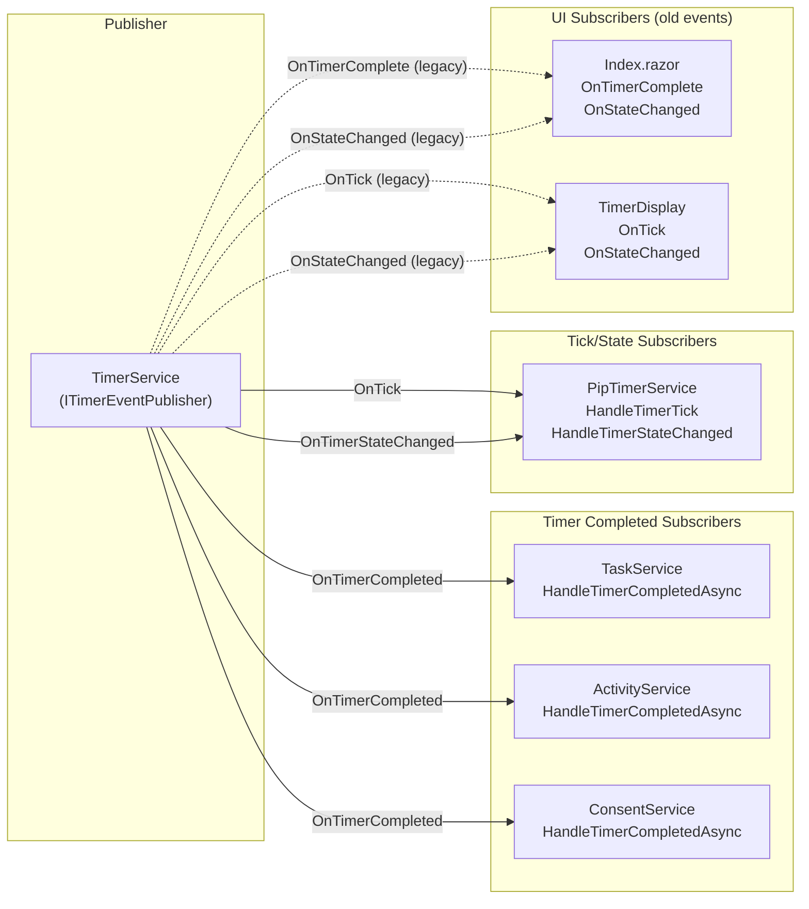
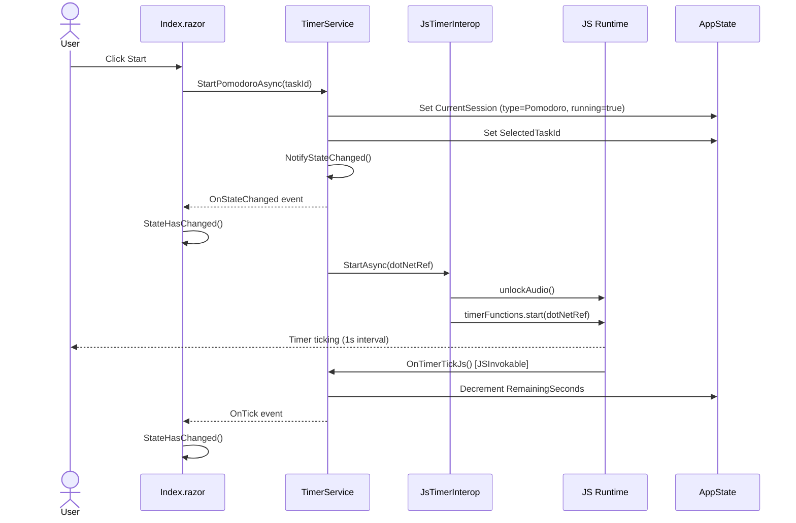
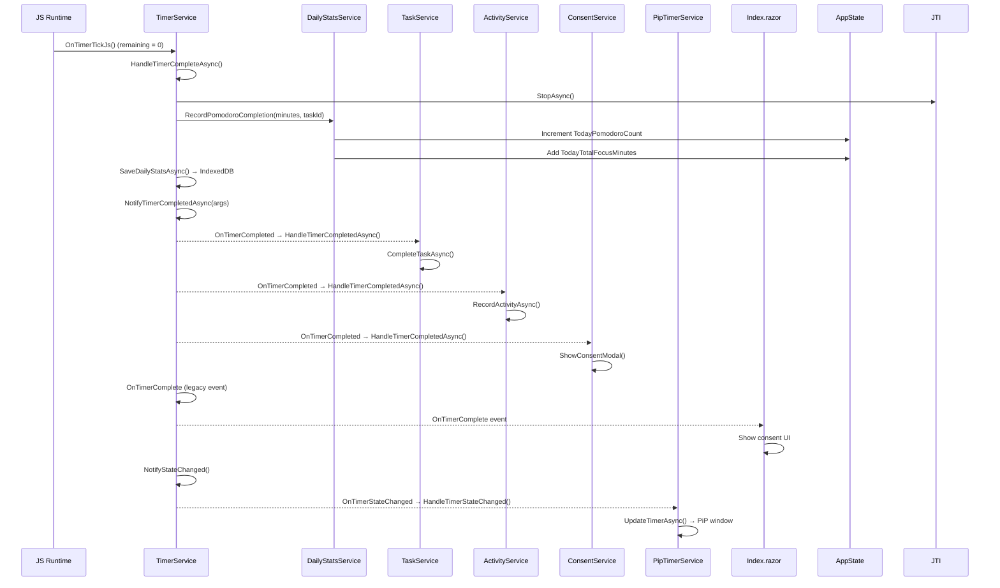
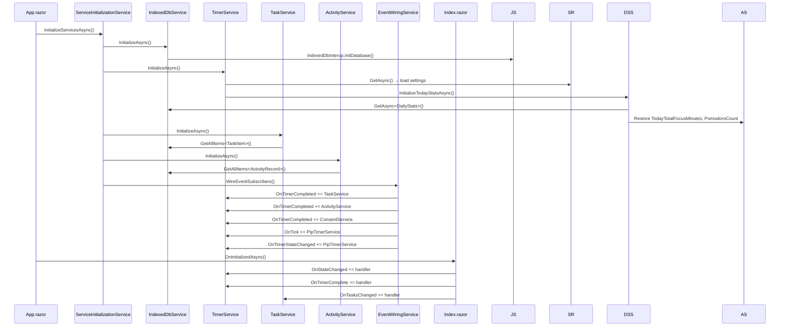
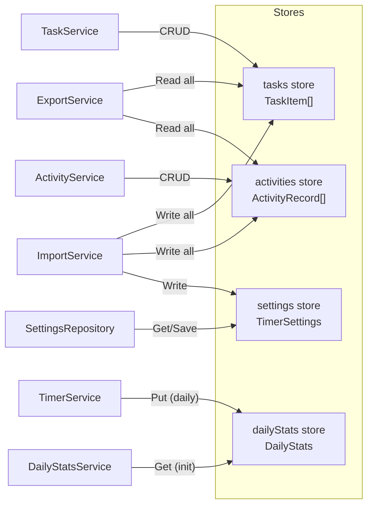

# Code Execution Map

## Architecture Overview

```
┌─────────────────────────────────────────────────────────┐
│                    Blazor WASM App                       │
│                                                         │
│  ┌──────────┐  ┌──────────┐  ┌──────────┐  ┌────────┐ │
│  │  Index    │  │ History  │  │ Settings │  │ About  │ │
│  │  .razor   │  │  .razor  │  │  .razor  │  │ .razor │ │
│  └────┬─────┘  └────┬─────┘  └────┬─────┘  └────────┘ │
│       │              │              │                    │
│  ┌────▼──────────────▼──────────────▼─────────────────┐ │
│  │              Service Layer                          │ │
│  │  TimerService · TaskService · ActivityService       │ │
│  │  PipTimerService · ConsentService · ChartService    │ │
│  └────────────────────┬───────────────────────────────┘ │
│                       │                                  │
│  ┌────────────────────▼───────────────────────────────┐ │
│  │           Repository Layer                          │ │
│  │  ActivityRepository · TaskRepository                │ │
│  │  SettingsRepository · IndexedDbService              │ │
│  └────────────────────┬───────────────────────────────┘ │
│                       │                                  │
│  ┌────────────────────▼───────────────────────────────┐ │
│  │           JS Interop Layer                          │ │
│  │  timerFunctions · indexedDbInterop · pipTimer       │ │
│  │  notificationFunctions · chartInterop · localDateTime│ │
│  └────────────────────────────────────────────────────┘ │
└─────────────────────────────────────────────────────────┘
```

---

## Service Dependency Graph

```mermaid
graph TD
    subgraph Pages
        Index["Index.razor"]
        History["History.razor"]
        Settings["Settings.razor"]
    end

    subgraph Services
        TimerService["TimerService"]
        TaskService["TaskService"]
        ActivityService["ActivityService"]
        PipTimerService["PipTimerService"]
        ConsentService["ConsentService"]
        DailyStatsService["DailyStatsService"]
        JsTimerInterop["JsTimerInterop"]
        StatisticsService["StatisticsService"]
        ImportService["ImportService"]
        ExportService["ExportService"]
        NotificationService["NotificationService"]
        ChartService["ChartService"]
        KeyboardShortcutService["KeyboardShortcutService"]
        LocalDateTimeService["LocalDateTimeService"]
        HistoryStatsService["HistoryStatsService"]
        SessionOptionsService["SessionOptionsService"]
        TodayStatsService["TodayStatsService"]
    end

    subgraph Repositories
        IndexedDbService["IndexedDbService"]
        ActivityRepository["ActivityRepository"]
        TaskRepository["TaskRepository"]
        SettingsRepository["SettingsRepository"]
    end

    subgraph State
        AppState["AppState"]
    end

    subgraph JS
        JSRuntime["IJSRuntime"]
    end

    Index --> TimerService
    Index --> TaskService
    Index --> ConsentService
    Index --> NotificationService
    Index --> ActivityService
    Index --> PipTimerService
    Index --> AppState
    Index --> JSRuntime
    Index --> KeyboardShortcutService
    Index --> TodayStatsService

    History --> ActivityService
    History --> StatisticsService
    History --> JSRuntime
    History --> HistoryStatsService
    History --> LocalDateTimeService

    Settings --> TimerService
    Settings --> ExportService
    Settings --> ImportService
    Settings --> TaskService
    Settings --> ActivityService

    TimerService --> IndexedDbService
    TimerService --> SettingsRepository
    TimerService --> DailyStatsService
    TimerService --> JsTimerInterop
    TimerService --> AppState

    DailyStatsService --> IndexedDbService
    DailyStatsService --> AppState

    JsTimerInterop --> JSRuntime

    TaskService --> TaskRepository
    TaskService --> IndexedDbService
    TaskService --> AppState

    ActivityService --> ActivityRepository

    StatisticsService --> ActivityRepository

    ImportService --> ActivityRepository
    ImportService --> TaskRepository
    ImportService --> SettingsRepository

    ExportService --> ActivityRepository
    ExportService --> TaskRepository
    ExportService --> SettingsRepository

    PipTimerService --> JSRuntime
    PipTimerService --> TimerService
    PipTimerService --> TaskService
    PipTimerService --> AppState

    ConsentService --> TimerService
    ConsentService --> TaskService
    ConsentService --> NotificationService
    ConsentService --> AppState
    ConsentService --> SessionOptionsService

    NotificationService --> JSRuntime
    NotificationService --> AppState

    ChartService --> JSRuntime

    KeyboardShortcutService --> JSRuntime

    LocalDateTimeService --> JSRuntime

    SessionOptionsService --> AppState

    TodayStatsService --> ActivityService

    ActivityRepository --> IndexedDbService
    TaskRepository --> IndexedDbService
    SettingsRepository --> IndexedDbService

    IndexedDbService --> JSRuntime
```



---

## Event Flow Diagram



---

## Sequence: Timer Start (Pomodoro)



---

## Sequence: Timer Complete



---

## Sequence: Page Initialization



---

## JS Interop Map

### .NET → JS Calls (41 functions)

| Module | Functions | Called By |
|--------|-----------|-----------|
| `timerFunctions` | `start`, `stop` | JsTimerInterop |
| `indexedDbInterop` | `initDatabase`, `getItem`, `getAllItems`, `getItemsByIndex`, `getItemsByDateRange`, `putItem`, `putAllItems`, `deleteItem`, `clearStore`, `getCount` | IndexedDbService |
| `pomodoroConstants` | `initialize` | IndexedDbService |
| `pipTimer` | `isSupported`, `registerDotNetRef`, `unregisterDotNetRef`, `open`, `close`, `update` | PipTimerService |
| `notificationFunctions` | `registerDotNetRef`, `unregisterDotNetRef`, `requestNotificationPermission`, `showNotification`, `playTimerCompleteSound`, `playBreakCompleteSound`, `unlockAudio` | NotificationService, JsTimerInterop |
| `localDateTime` | `getLocalDate`, `getLocalDateTime`, `getTimezoneOffset` | LocalDateTimeService |
| `keyboardShortcuts` | `initialize`, `dispose` | KeyboardShortcutService |
| `infiniteScroll` | `isSupported`, `createObserver`, `destroyObserver`, `destroyAllObservers` | InfiniteScrollInterop |
| `chartInterop` | `createBarChart`, `createGroupedBarChart`, `createDoughnutChart`, `updateChart`, `destroyChart`, `ensureInitialized` | ChartService |
| Global | `getUrlParameter`, `removeUrlParameter` | JSInteropService |

### JS → .NET Callbacks (6 [JSInvokable] methods)

| Method | On Class | Triggered By |
|--------|----------|-------------|
| `OnTimerTickJs` | TimerService | `timerFunctions.start` (1s interval) |
| `OnPipToggleTimer` | PipTimerService | PiP window play/pause button |
| `OnPipResetTimer` | PipTimerService | PiP window reset button |
| `OnPipSwitchSession` | PipTimerService | PiP window session tab |
| `OnPipClosed` | PipTimerService | PiP window close |
| `OnNotificationActionClick` | NotificationService | Browser notification click |

---

## Dual Event System (Technical Debt)

TimerService currently fires **both** old and new events for backward compatibility:

| Notification | Old Event (ITimerService) | New Event (ITimerEventPublisher) |
|---|---|---|
| Tick | `OnTick` | `OnTick` (same name, same backing field) |
| State changed | `OnStateChanged` | `OnTimerStateChanged` |
| Timer completed | `OnTimerComplete(SessionType)` | `OnTimerCompleted(TimerCompletedEventArgs)` |

**Subscribers by event system:**

| Subscriber | Uses Old Events | Uses New Events |
|---|---|---|
| Index.razor | `OnTimerComplete`, `OnStateChanged` | - |
| TimerDisplay.razor | `OnTick`, `OnStateChanged` | - |
| TaskService | - | `OnTimerCompleted` |
| ActivityService | - | `OnTimerCompleted` |
| ConsentService | - | `OnTimerCompleted` |
| PipTimerService | - | `OnTick`, `OnTimerStateChanged` |

---

## Data Flow: IndexedDB Stores


