# Code Execution Map

Four-layer Blazor WASM architecture: UI pages depend on services, services depend on repositories, repositories depend on JS interop. All timer events flow through a single `ITimerEventPublisher` interface.

## Architecture Overview

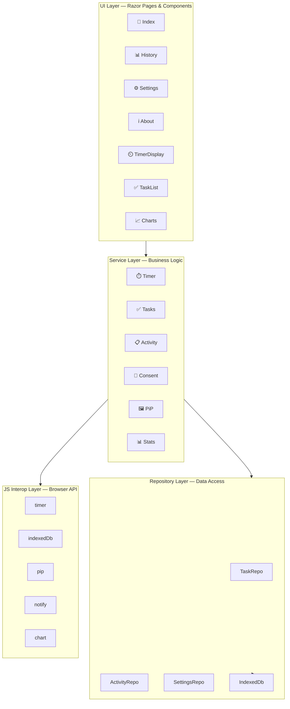

---

## Service Dependency Graph

Split into 4 diagrams by layer. Pages inject services; services inject repositories or other services; repositories go through IndexedDbService to JS.

### Pages → Services

```mermaid
graph TD
    subgraph Pages["Pages"]
        Index["📄 Index.razor"]
        History["📄 History.razor"]
        Settings["📄 Settings.razor"]
    end

    subgraph Services["Services"]
        TimerService["⏱️ TimerService"]
        TaskService["✅ TaskService"]
        ActivityService["📋 ActivityService"]
        ConsentService["🔔 ConsentService"]
        NotificationService["🔔 NotificationService"]
        PipTimerService["🖼️ PipTimerService"]
        ExportService["📤 ExportService"]
        ImportService["📥 ImportService"]
        StatisticsService["📈 StatisticsService"]
        TodayStatsService["📅 TodayStatsService"]
        KeyboardShortcutService["⌨️ KeyboardShortcut"]
        InfiniteScroll["📜 InfiniteScroll"]
        LocalDateTimeService["🕐 LocalDateTime"]
        HistoryStatsService["HistoryStats"]
    end

    Index --> TimerService
    Index --> TaskService
    Index --> ConsentService
    Index --> NotificationService
    Index --> ActivityService
    Index --> PipTimerService
    Index --> KeyboardShortcutService
    Index --> TodayStatsService
    Index --> InfiniteScroll
    Index --> LocalDateTimeService

    History --> ActivityService
    History --> StatisticsService
    History --> InfiniteScroll
    History --> HistoryStatsService
    History --> LocalDateTimeService

    Settings --> TimerService
    Settings --> ExportService
    Settings --> ImportService
    Settings --> TaskService
    Settings --> ActivityService
```

### Core Services → Their Dependencies

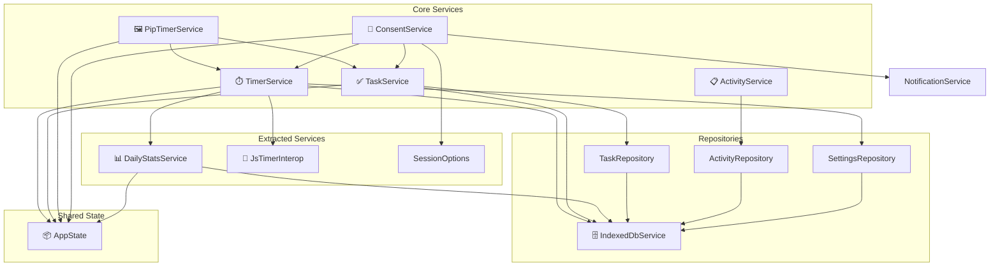

### Import / Export Services

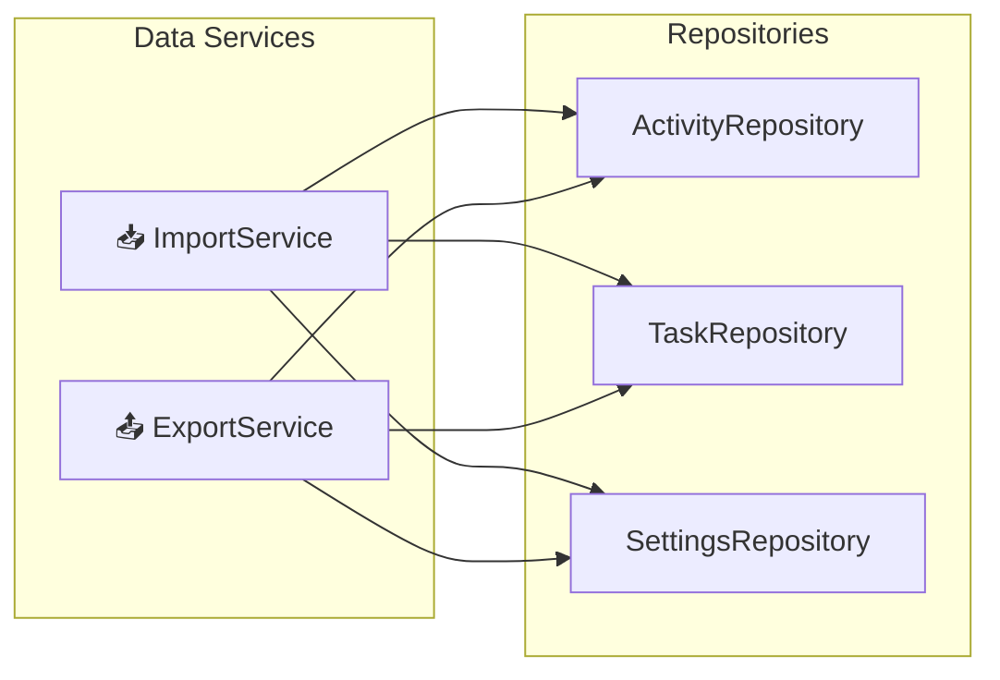

### UI Interop → JS Runtime

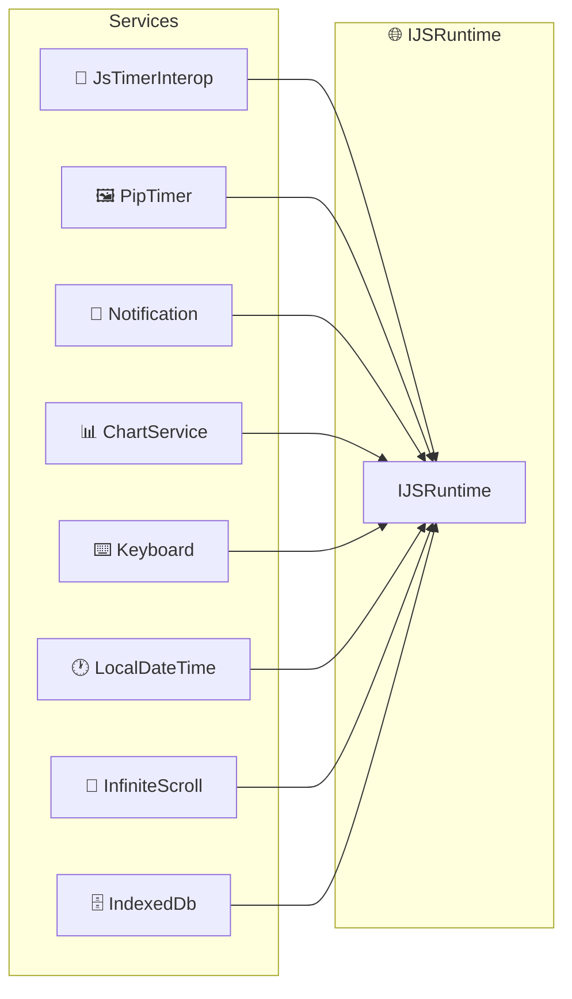

---

## Event Flow Diagram

All timer events use `ITimerEventPublisher`. `OnTimerCompleted` is async with rich args; `OnTick` and `OnTimerStateChanged` are sync. Wired once at startup by `EventWiringService`.

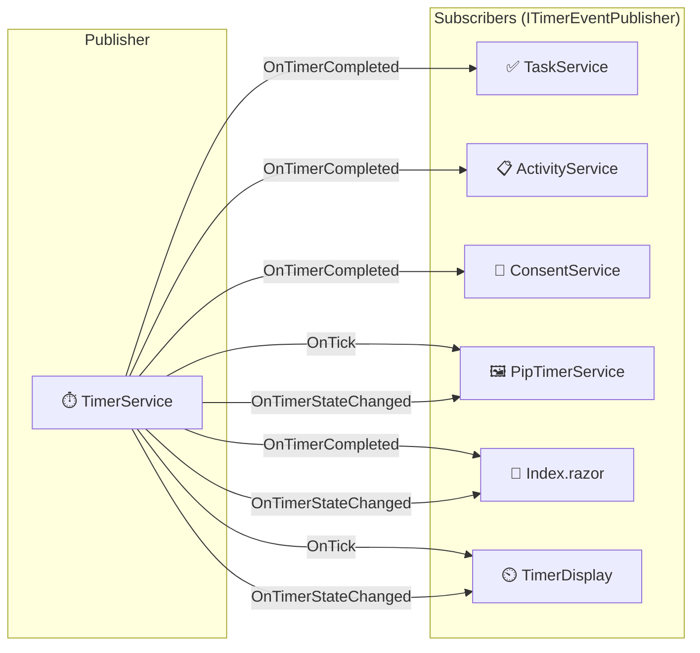

---

## Sequence: Timer Start

User clicks start, session is created, JS timer begins ticking, and `OnTick`/`OnTimerStateChanged` events drive UI updates every second.

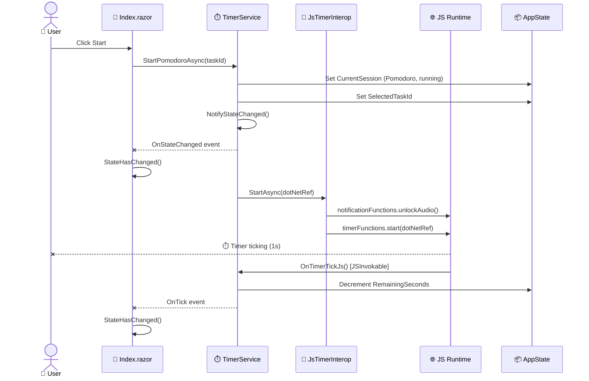

---

## Sequence: Timer Complete

When remaining seconds hit zero: stats are recorded, subscribers are notified in sequence (task completion, activity recording, consent modal), and PiP window is updated.

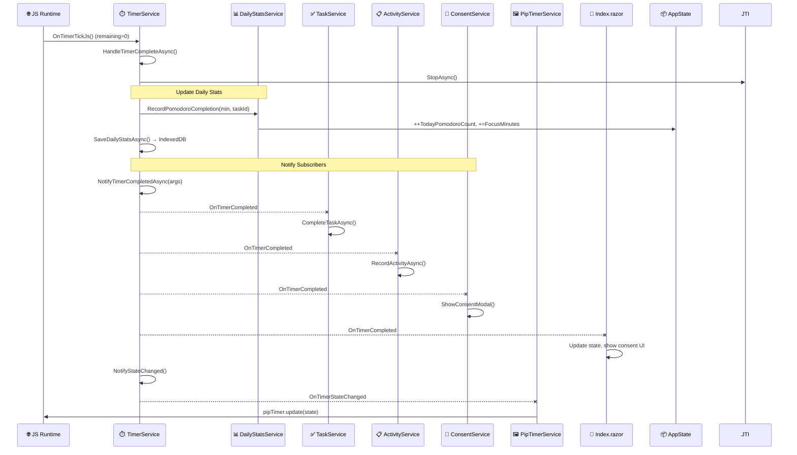

---

## Sequence: App Initialization

On startup: IndexedDB is initialized, services load cached data, and `EventWiringService` connects publisher to subscribers before the first render.

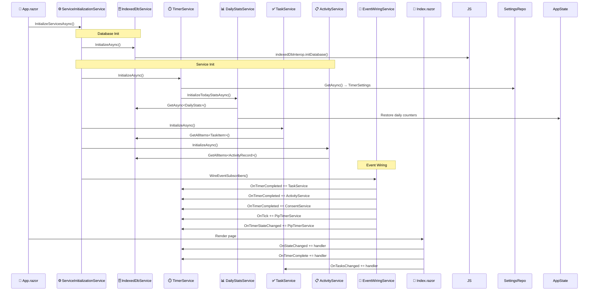

---

## JS Interop Map

47 interop points total: 41 .NET-to-JS calls across 9 modules, plus 9 JS-to-.NET callbacks via `[JSInvokable]`.

### .NET → JS Calls

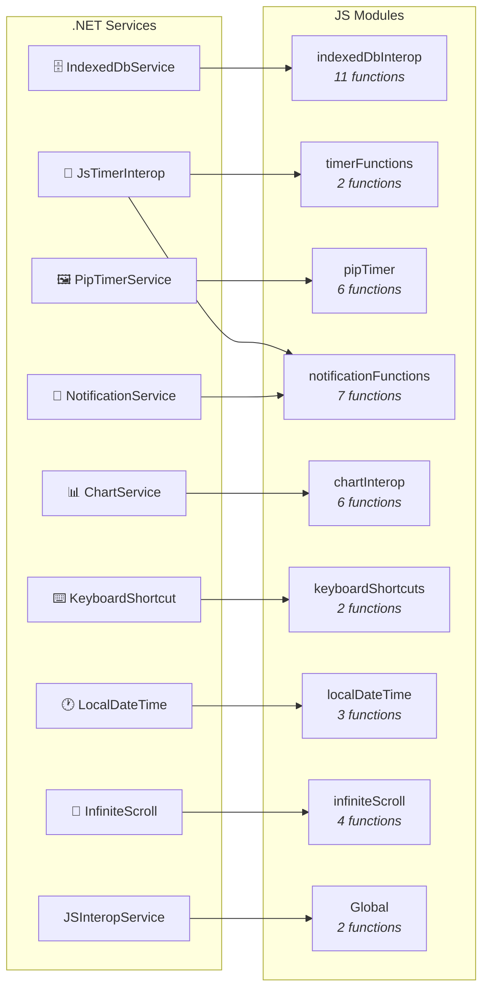

| Module | Functions | Called By |
|--------|-----------|-----------|
| `indexedDbInterop` | `initDatabase`, `getItem`, `getAllItems`, `getItemsByIndex`, `getItemsByDateRange`, `putItem`, `putAllItems`, `deleteItem`, `clearStore`, `getCount`, `initializeJsConstants` | IndexedDbService |
| `timerFunctions` | `start`, `stop` | JsTimerInterop |
| `pipTimer` | `isSupported`, `registerDotNetRef`, `unregisterDotNetRef`, `open`, `close`, `update` | PipTimerService |
| `notificationFunctions` | `registerDotNetRef`, `unregisterDotNetRef`, `requestNotificationPermission`, `showNotification`, `playTimerCompleteSound`, `playBreakCompleteSound`, `unlockAudio` | NotificationService, JsTimerInterop |
| `chartInterop` | `createBarChart`, `createGroupedBarChart`, `createDoughnutChart`, `updateChart`, `destroyChart`, `ensureInitialized` | ChartService |
| `keyboardShortcuts` | `initialize`, `dispose` | KeyboardShortcutService |
| `localDateTime` | `getLocalDate`, `getLocalDateTime`, `getTimezoneOffset` | LocalDateTimeService |
| `infiniteScroll` | `isSupported`, `createObserver`, `destroyObserver`, `destroyAllObservers` | InfiniteScrollInterop |
| Global | `getUrlParameter`, `removeUrlParameter` | JSInteropService |

### JS → .NET Callbacks

9 `[JSInvokable]` methods across 6 classes. Timer tick is the highest-frequency callback (every second).

| Method | Class | Trigger |
|--------|-------|---------|
| `OnTimerTickJs` | TimerService | Timer tick (1s interval) |
| `OnPipToggleTimer` | PipTimerService | PiP play/pause button |
| `OnPipResetTimer` | PipTimerService | PiP reset button |
| `OnPipSwitchSession` | PipTimerService | PiP session tab |
| `OnPipClosed` | PipTimerService | PiP window close |
| `OnNotificationActionClick` | NotificationService | Browser notification click |
| `OnSentinelIntersecting` | HistoryBase | Scroll sentinel visible |
| `HandleShortcut` | KeyboardShortcutService | Key press |
| `NavigateTo` | MainLayout | Navigation event |

---

## Data Flow: IndexedDB

4 stores: tasks and activities are read/write from multiple services; settings and daily stats have single-writer patterns.

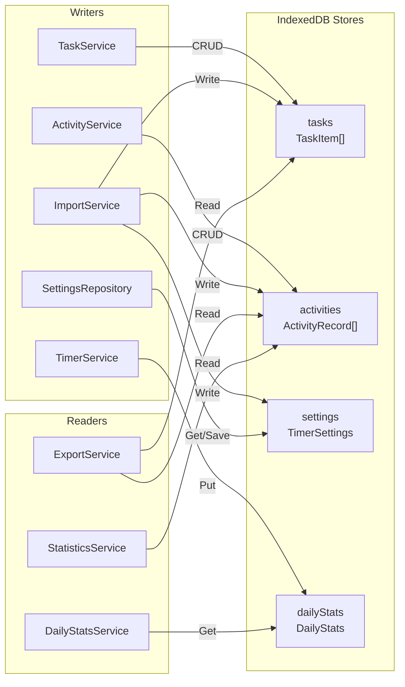

---

## Page Injection Summary

### Index.razor (12 services)

The main page with the most dependencies. It orchestrates timer, tasks, consent, notifications, PiP, keyboard shortcuts, and today's stats display.

| Service | Purpose |
|---------|---------|
| `ITaskService` | Task CRUD, selection, completion |
| `ITimerService` | Timer start/pause/reset |
| `IConsentService` | Post-pomodoro consent modal |
| `INotificationService` | Browser notifications |
| `IActivityService` | Activity history queries |
| `IPipTimerService` | Picture-in-Picture timer |
| `AppState` | Global state (session, settings, stats) |
| `IJSRuntime` | Direct JS interop |
| `IKeyboardShortcutService` | Keyboard shortcuts |
| `ITodayStatsService` | Today's summary stats |
| `IInfiniteScrollInterop` | Infinite scroll for tasks |
| `ILocalDateTimeService` | Local date/time |
| `ILogger<IndexBase>` | Logging |

### History.razor (8 services)

Activity history with infinite scroll, weekly charts, and time distribution. Reads only — no writes to data stores.

| Service | Purpose |
|---------|---------|
| `IActivityService` | Activity queries |
| `IStatisticsService` | Weekly stats, time distribution |
| `IJSRuntime` | Direct JS interop |
| `IInfiniteScrollInterop` | Infinite scroll for activities |
| `IHistoryStatsService` | Daily summary formatting |
| `HistoryPagePresenterService` | View formatting logic |
| `ILocalDateTimeService` | Local date/time |
| `ILogger<HistoryBase>` | Logging |

### Settings.razor (8 services)

App configuration page with export/import, timer settings, and data management. Uses both Export and Import services for backup/restore.

| Service | Purpose |
|---------|---------|
| `ITimerService` | Timer settings reference |
| `IExportService` | Data export (JSON) |
| `IImportService` | Data import (JSON) |
| `ITaskService` | Task data for import/export |
| `IActivityService` | Activity data for import/export |
| `IJSInteropService` | JS interop (file picker) |
| `SettingsPresenterService` | Settings formatting logic |
| `ILogger<SettingsPageBase>` | Logging |
